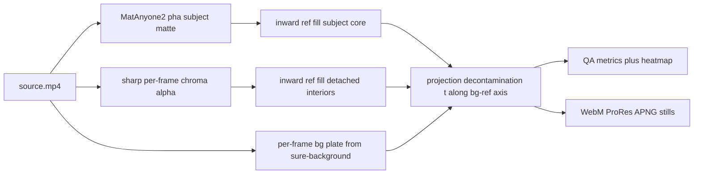

# Alpha Compiler v6: Projection Decontamination and Generalization

## Assessment

v5 ([scripts/spikes/transparent-animation-spike.ts](scripts/spikes/transparent-animation-spike.ts), `createV5RgbaFrame` ~L2989) is architecturally right: MatAnyone2 matte for the subject, sharp per-frame chroma for detached elements, guard band between them. The three residual defects share one root cause — **all RGB repair paths are variants of "reduce the green channel," which can only desaturate mixed pixels, never reconstruct them**:

- Tail tinge: fringe pixels like src `(155,176,124)` (white fur ⊕ ~35% green) get a partial pull (`min(0.9, excess/255×6) × edgeWeight ≈ 0.34`) → still ~66% contaminated. Raising gain damaged legitimate olive/green interiors — a dead end.
- Leaf desaturation: blanket `despillDominantChannel(mix=0.55)` over every detached pixel strips green from legitimately yellow/orange interiors.
- Sparkle muddiness: same blanket despill turns cyan content teal-gray. (Per your steer: sparkles get no special-casing — they're just another detached element the mechanism must handle.)

Also verified: MatAnyone2's `fgr` frames are source-over-pale-green composites, not predicted clean foreground (un-compositing reproduces source exactly) — worth recording in the doc as a negative finding. And the MatAnyone2 leg is currently a manual, undocumented step the harness can't reproduce.

## Phase 1 - v6 fusion stage (new `celstate-alpha-v6-projection` in the spike harness)

**Core mechanism — projection decontamination.** For a pixel `src` with local background plate color `bg` and foreground reference `ref`:

```text
t   = clamp( dot(src - ref, bg - ref) / |bg - ref|^2 , 0..1 )   // contamination fraction
out = src - t * (bg - ref)                                       // remove exactly the bg component
```

Verified on the real tail pixel: `(155,176,124)` → `(243,200,187)` warm white; olive pixels give `t≈0` → untouched. No division by alpha (kills the v3 ghost-double failure mode), no channel clamping (kills desaturation), key-color agnostic (works for any plate color, not just green).

**Inputs it needs, both already half-built:**
- `ref` — extend existing `fillInwardCoreColors` (L2915): inward fill from deep core for the subject; separate inward fill from leaf/detached interiors (chroma-alpha distance transform) for detached elements.
- `bg` — per-frame local plate: outward fill / blurred image of sure-background pixels only (`pha ≤ cutoff` AND chroma-transparent), replacing the constant `#23af42`. Per-frame and foreground-masked, so it avoids the v2 plate-contamination failure.

**Application gating (replaces all three despill paths):**
- Subject fringe + core despill band: projection with subject `ref`, strength ramped by the existing `edgeWeight`/band weight but allowed to reach ~1.0 (safe now, since `t` nets out legitimate greens via `ref`).
- Detached elements: projection only within an edge band of the chroma alpha (distance transform, full strength at boundary → 0 a few px inward). Interiors untouched → leaf vibrancy and sparkle cyan preserved.
- Optional tunables: chroma-alpha gamma for detached interiors (reduce background bleed-through darkening), luma/hue restore toggle. Keep v5's alpha sources unchanged.

Iterate on the existing run (`tmp/transparent-animation-spike/runs/test3-trim1-sampled-green-s20`, prior frames already on disk, ~80s per fusion run) until: no visible tail tinge, detached colors match source, no regression on olive/jacket/fur, clean over cream/red/dark/texture, stable across the full 9s clip.

## Phase 2 - QA metrics (the "confidence/artifact report" thesis output)

Add to the v6 `report.json` + a heatmap PNG artifact:
- residual spill score: mean key-dominance excess vs `ref` over `alpha > 0` pixels (per frame + summary);
- detached-color fidelity: mean RGB delta between output and source over detached interiors (should be ~0 in v6);
- temporal stability: mean `|alpha_t - alpha_(t-1)|` within the subject band (flags matte breathing/flicker).

These convert eyeballing into per-run regression numbers and start the compiler's artifact-report layer.

## Phase 3 - Reproducible video-prior leg

The MatAnyone2 step (seed mask -> inference -> `pha/` frames) currently lives outside the harness. Add a scripted `video-prior` stage:
- frame-1 prior via the proven `uvx rembg ... bria-rmbg` path → threshold to seed mask (replicating today's manual `first-frame-mask.png`);
- invoke MatAnyone2 (locate the env you used today, or recreate as a pinned `uv` venv with CUDA torch — RTX 2060 SUPER confirmed); keep `--prior-alpha-dir` as escape hatch;
- normalize outputs into the stage directory; document the invocation in the spike doc.

## Phase 4 - Promote, document, then generalize

- Promote the winning v6 output to `tmp/transparent-animation-spike/review/` and update [docs/archive/TRANSPARENT-ANIMATION-RD-SPIKE.md](docs/archive/TRANSPARENT-ANIMATION-RD-SPIKE.md): v5 results, the fgr negative finding, v6 design/results, refreshed failure taxonomy and next steps.
- Generalization probes (the real "full vision" test, justified per the doc's own escalation rule since one clip can't answer generalization): generate 1-2 new probe sources with different content stress — e.g. a dark-palette subject, and semi-transparent/glow content (smoke, particles), ideally one on a non-green key to prove key-agnosticism. Run the identical v6 pipeline; only mechanism-level (never clip-specific) fixes allowed.

