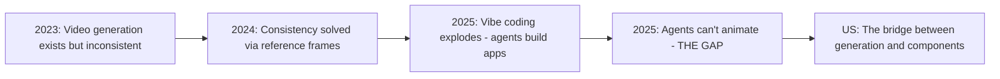

# Project Strategy: Converting "Vision" into "Architecture"

This document translates the high-level vision into a concrete engineering roadmap. It clarifies *what* we are building and *why*.

---

## 1. The Core Question: Are we building a Library?
**YES.** This is the most critical realization.

If we only built an API that returned video files, the user would have to write complex code to handle looping, preloading, and seamless transitions. That is too hard.

We are building a **Two-Part System**:

### Part A: The "Cartridge" Factory (The API)
*   **What it does:** Generates the assets (videos) AND a `manifest.json` (the instructions).
*   **Input:** "A nervous button"
*   **Output:** 
    *   `nervous_loop.webp`
    *   `click_transition.webp`
    *   `manifest.json` (Maps user clicks to specific video files)

### Part B: The "Console" Player (The Client Library)
*   **What it does:** A React Native library (`npm install @ai-media/client`) that understands how to read the "Cartridge".
*   **Usage:** The user just imports our component.
    ```tsx
    import { GenerativeActor } from '@ai-media/client';

    // The user writes ONE line of code. 
    // Our library handles all the complex video swapping logic.
    <GenerativeActor source={require('./nervous_button_manifest.json')} />
    ```

> **The Metaphor:** The API makes the **Movie Disc**. The Library is the **DVD Player**. You cannot sell the disc if the user doesn't have the player.

---

## 2. The 3 "Non-Negotiables"
To succeed, we must follow these three rules.

### Rule 1: "Intent → Component" (The Vending Machine)
The user should never have to stitch files together manually.
*   **Bad:** Giving the user 5 separate video files and saying "Good luck!"
*   **Good:** Giving the user a single JSON Manifest that describes exactly how those 5 files work together.
*   **Success Definition:** An agent can request a component in *one call* and it "just works" in a React Native screen with correct sizing, taps, accessibility, and no animation code.

### Rule 2: The Runtime is a "State Machine"
Real-time 3D is too heavy for phones. So we cheat.
We pre-record every possible move the character can make.
*   **Idle State:** Plays `idle.webp` on loop.
*   **User Taps:** The library INSTANTLY swaps to `tap.webp`.
*   **The Trick:** The library must "preload" the tap video so there is zero delay. If there is a delay, the magic breaks.
*   **Our Job:** We must build this "Smart Player" that manages these swaps perfectly.
*   **Success Definition:** Swapping states feels *instantaneous and deterministic*—no flicker, no hitches—even on mid-tier Android.

### Rule 3: Difference Matting is our "Moat"
Why hasn't anyone done this before? Because generated videos usually have ugly edges (white halos) when you put them on a colored background.
*   **Our Secret Sauce:** Your dual-pass generation (White Background / Black Background) + Math Extraction.
*   **Result:** We can generate semi-transparent smoke, shadows, and glass that look perfect on *any* app background. This is what makes our components "AAA Quality."
*   **Success Definition:** Soft shadows, smoke, and glass look correct over *any* UI background and theme—not just in controlled demos.

---

## 3. The Manifest v0 Spec (The Foundation)

> [!IMPORTANT]
> If you do nothing else, do this. A good manifest turns "generative video" into "a component primitive."

The manifest should be **boring, strict, and lintable**. It covers only what's needed for MVP components:

| Field | Description |
|-------|-------------|
| **Bounding Box / Layout** | Intrinsic size, safe padding, anchor point |
| **Hit Regions** | Tappable shape(s)—not just the video rect |
| **States** | `id`, `clip`, `loop`, `fps`, `duration`, `loopStartFrame`, `loopEndFrame` |
| **Transitions** | `from`, `to`, `on` (event), `clip`, `exitAtFrame`, `enterAtFrame` |
| **Preload Hints** | Which states are "likely next" (so we can prefetch) |
| **Accessibility** | `label`, `role`, reduced-motion alternatives |
| **Fallbacks** | Static image, low-end variant, no-alpha variant |

---

## 4. The `<GenerativeActor />` Runtime Requirements

Treat this like a **game engine subsystem**: strict budgets and predictable behavior.

| Requirement | Description |
|-------------|-------------|
| **Zero-latency state swap** | Via aggressive preloading of "likely next" states |
| **Frame-accurate cut points** | Or at minimum, "end-of-clip" boundary if frame-accurate is too hard for v0 |
| **Graceful degradation** | Reduced motion mode, low-memory mode, handle Android codec weirdness |
| **Telemetry hooks** | Track decode time, dropped frames, memory usage (so we can debug on real devices) |

> This is where most "cool ideas" either become real—or die.

---

## 5. The Template-Based Generation Strategy

> [!TIP]
> Don't try to generate arbitrary state graphs immediately. Start with **templates** that the generator fills.

You'll get far more reliability by generating within **known topologies** than letting the model invent graphs from scratch.

**Example: ButtonTemplate v0**
```
idle_loop          (required)
press_down         (one-shot transition)
pressed_loop       (optional, for held state)
release_up         (one-shot transition)
disabled_loop      (optional)
error_shake        (optional, one-shot)
```

The generator fills in the visuals; the *structure* is fixed and predictable.

---

## 6. The "Plain English" Roadmap

### Phase 0: Prove the Runtime Loop *(Not the Art)*
**Goal:** Manifest v0 + linter, `<GenerativeActor />` swaps states smoothly on real devices, one archetype (ButtonActor), hard budgets for file size/resolution/fps with automatic downscaling.

**Exit Criteria:** 3 different button intents generated and used in an actual React Native app with **no manual fix-ups**.

---

### Phase 1: Minimum Useful Library
**Goal:** Add more archetypes, accessibility, caching, and proper tooling.

*   Add `ToggleActor`, `LoaderActor`, `ToastActor`
*   Add accessibility + reduced-motion variants
*   Add caching strategy (disk + memory), versioning, CDN layout
*   Tooling for agents: a strict schema and examples—not "prompt magic"

**Exit Criteria:** An agent can assemble a basic settings screen + onboarding using your components.

---

### Phase 2: Style Modifiers + Reliability
**Goal:** Make it feel "AAA" consistently, not occasionally.

*   Idle life variants (boiling line, secondary motion)
*   Acting choices ("nervous but hiding it")
*   Continuity constraints (pose lock, silhouette lock)
*   Automated QA checks: loop seam detection, alpha halo checks, edge shimmer checks

**Exit Criteria:** Components look premium *every time*, not just when you get lucky.

---

### Phase 3: Composed Scenes (Multiplane / Generative FMV)
**Goal:** Enable complex "cinematic" experiences.

*   `ActorStack` (multiple layers + parallax hooks)
*   Branching "micro-cinematics" for onboarding/education moments
*   Crowd variation packs (ambient extras)

**Exit Criteria:** You can build a "cinematic home screen" without turning your runtime into a custom game engine.

---

## 7. The 6 Core Component Archetypes

These are the primitives agents actually need. Start here—not with techniques:

| Archetype | Purpose |
|-----------|---------|
| **ButtonActor** | Primary CTA (idle → press → release) |
| **Toggle/SwitchActor** | Binary state toggle (on ↔ off) |
| **Chip/TagActor** | Selectable pill for filters, categories |
| **Loader/ProgressActor** | Ambient motion for loading states |
| **Notification/ToastActor** | Enter/exit transitions for alerts |
| **Mascot/AssistantActor** | Optional, but great for demos—a little character helper |

---

## 8. Organizing the "Lost Techniques" (Modifier Buckets)

Your VISION.md lists many cool techniques. Here's how to organize them as **modifiers** (not features):

### Bucket A: Idle Life
*(boiling line, secondary motion, micro-variation)*
- **Highest visual ROI**
- Low interactivity complexity
- Great for buttons, chips, loaders

### Bucket B: Continuity Transitions
*(match cuts, acting choices, smear frames)*
- Directly improves "it feels alive"
- Requires stricter generation constraints (pose continuity)

### Bucket C: Environmental Integration
*(soft shadows, smoke, glass, FX passes)*
- This is your difference-matting superpower
- Applies broadly—but keep budgets tight

### Bucket D: Scene Compositing
*(multiplane, destructible pre-rendered scenes, crowds)*
- Most powerful, but easiest to overbuild
- **Defer until the core component loop is working**

> In other words: don't ship "multiplane." Ship `ActorStack` later—a composition primitive that *enables* multiplane.

---

## 9. The Biggest Trap to Avoid

> [!CAUTION]
> **Don't chase "infinite states" yet.**

Your VISION.md includes ideas like "pre-render every possible state." That's philosophically true, but operationally you should aim for:
- **Finite templates**
- **Predictable topologies**
- **On-demand expansion** (generate additional branches when needed, cache them)

This keeps you from building an untestable, unshippable combinatorial explosion.

---

## 10. Summary: The One-Sentence Priority

**Standardize the manifest + runtime until an agent can request a button and get a deterministic, beautiful, interactive component every time—then scale styles and scenes.**

If you build a robust engine that can seamlessly swap between two video loops based on a click, **you have won**. The art is easy after that.

---

# Appendix A: Technical Feasibility Analysis

> **Question:** "Can we actually build a library that plugs into any mobile app and stitches these assets together?"
> **Answer:** Yes. Nothing here requires a research breakthrough—every piece has been done before.

---

## A.1 Prior Art (This Pattern Already Works)

| Product | What It Does | Why It's Relevant |
|---------|--------------|-------------------|
| **Lottie** | Plays JSON-defined vector animations | Same pattern: manifest + assets + runtime player |
| **Rive** | State machine-based animations | Literally a "state machine animation player" for mobile |
| **expo-video** / **react-native-video** | Plays video in RN apps | The base primitive we'd build on |
| **Every 2D game engine** | Sprite sheets with state machines | We're just using video frames instead of PNGs |

The `<GenerativeActor />` we'd build is conceptually **simpler** than Rive (which has blend trees, IK, etc.). We're just swapping video sources.

---

## A.2 Risk Assessment Matrix

| Risk Level | Area | Notes |
|------------|------|-------|
| 🟢 Low | Building the RN component | Standard React patterns |
| 🟢 Low | Preloading and swapping video sources | Decades-old "double buffering" technique |
| 🟢 Low | Manifest format / state machine logic | Just JSON + a reducer |
| 🟡 Medium | Alpha channel compatibility (Android) | Solvable with format negotiation |
| 🟡 Medium | Frame-accurate transition timing | May need to accept "end-of-clip" boundary for v0 |
| 🔴 None | Fundamental blockers | No "this can't work" issues identified |

---

## A.3 Alpha Channel Solutions Per Platform

| Platform | Recommended Format | Fallback |
|----------|-------------------|----------|
| **iOS** | HEVC with alpha (native support) | WebP animation |
| **Android** | WebP animation with alpha | VP9 with alpha, or RGB + separate alpha mask composited at runtime |
| **Universal Fallback** | Static PNG with transparency | For ancient devices or reduced-motion mode |

> [!NOTE]
> We've already solved the *hard* part (generating mathematically correct alpha via difference matting). Playing it back is easier.

---

## A.4 Memory Budget Reality Check

| Asset | Size |
|-------|------|
| 2-second 512x512 WebP loop @ 24fps | ~200-500KB |
| Typical component (3-5 states) | ~1-2MB total |
| 10 components loaded simultaneously | ~10-20MB |
| iPhone RAM | 4-6GB |
| **Memory usage** | **~0.3% of available RAM** |

Memory is a non-issue for reasonable component counts.

---

## A.5 The Component Shape (Pseudocode)

```tsx
function GenerativeActor({ manifest }) {
  const [currentState, setCurrentState] = useState('idle');
  const videoRefs = usePreload(manifest.states); // Preload all states upfront
  
  const transition = (toState) => {
    // Optionally wait for exitAtFrame, then swap
    setCurrentState(toState);
  };

  return (
    <Pressable onPress={() => transition('pressed')}>
      <Video 
        source={manifest.states[currentState].clip}
        loop={manifest.states[currentState].loop}
        ref={videoRefs[currentState]}
      />
    </Pressable>
  );
}
```

The "hard parts" are:
1. **Preloading strategy** – What to load, when to evict
2. **Transition timing** – Wait for current clip to hit `exitAtFrame` before swapping
3. **Android codec fallbacks** – Test matrix + fallback logic

---

## A.6 Estimated Implementation Effort

| Task | Effort |
|------|--------|
| Manifest v0 schema + linter | 2-3 days |
| Basic `<GenerativeActor />` with state swapping | 3-5 days |
| Preloading + zero-latency swap | 2-3 days |
| Android codec fallback handling | 3-5 days |
| Telemetry hooks + debugging tools | 2-3 days |
| **Total MVP** | **2-3 weeks** |

---

## A.7 Why We Must Build the Library (Not Just Assets)

> **Assets without a runtime = Figma exports.**
> **Assets with a runtime = A product.**

If we ship just assets, every customer must:
1. Write their own video player logic
2. Figure out alpha channel handling per platform
3. Build their own state machine
4. Debug Android codec issues themselves

**99% won't bother.** They'll compare us to Lottie, see extra work, and bounce.

But if we ship `npm install @ai-media/client` and it *just works*... now we have a product that's easier than the alternatives.

---

# Appendix B: The Unicorn Thesis — Why Now, Why Us

> **Question:** "Are we deluding ourselves, or have we found a genuine opportunity at the perfect moment in history?"
> **Answer:** The timing convergence is real. Let's examine the evidence.

---

## B.1 The Three Technological Breakthroughs (All Happened in 2024-2025)

### Breakthrough 1: Nano Banana Pro — Emotion Made Trivial

| Capability | What It Means |
|------------|---------------|
| **Emotional expression from text** | "A nervous button" → the model *understands* nervousness and renders it |
| **Character consistency across emotions** | Same character, different mood, same identity—automatically |
| **Deep reasoning before rendering** | Plans the scene, then draws—not random generation |
| **Art direction at API scale** | Every asset is "art-directed" by the model's creative inference, not a randomizer |

**The shift:** Previously, emotional UI required a human artist to *understand* the emotion and translate it to visuals. Now an agent can describe intent and receive emotionally coherent assets.

---

### Breakthrough 2: Veo 3.1 — Consistency Made Trivial

| Capability | What It Means |
|------------|---------------|
| **Reference image input** | Up to 3 reference images to lock identity, style, pose |
| **First + Last frame control** | Specify start and end states → smooth transition generated |
| **Character "drift" reduction** | Face, hair, outfit stay consistent across shots |
| **Environment stability** | Lighting, color palette, scene hold steady |

**The shift:** Previously, animation consistency required manual keyframing or expensive rigs. Now you provide reference frames→ Veo interpolates with cinematic quality. This is how we generate **state transition clips that look deliberate, not random**.

---

### Breakthrough 3: Vibe Coding — Agents Building Apps (But Blind)

| Trend | Evidence |
|-------|----------|
| **Andrej Karpathy coined "vibe coding"** | February 2025 |
| **Gartner prediction** | By 2027, 15% of apps will be automatically generated by AI |
| **Current adoption** | 80%+ of engineers using AI coding assistants daily |
| **The gap** | Agents can generate *code*, but they can't generate *lifelike motion* |

**The critical insight:** When an agent builds an app today, it can write a `<Button>` or add a Lottie animation from a library. It **cannot**:
- Generate a button that "looks nervous"
- Create a toggle that "feels satisfying"
- Design a loader that "matches the brand's energy"

**Why?** Because there's no API that translates emotional intent → interactive animated component.

> [!IMPORTANT]
> **We are building the missing actuator.** Agents can now see, reason, and code—but they can't *animate with emotion*. We give them that capability.

---

## B.2 The Market Size (This Is Not a Niche)

| Market | 2024 Valuation | Growth Trajectory |
|--------|----------------|-------------------|
| **Global Animation** | $371-433 billion | 8-10% CAGR |
| **Mobile-optimized animation** | 50%+ of all content now mobile-first | 40% increase in short-form animated content |
| **3D Animation** | $22.67B (2023) → $51B (2030) | 12% CAGR |
| **Mobile Gaming** (heavily animation-dependent) | $90B+ | Billions of active users |

**The implication:** Animation is not a "nice to have." It's a $400B+ industry, and mobile is eating it. Anyone building for mobile needs animation. Currently, they're stuck with:
- Lottie (limited expressiveness, requires designer)
- Rive (powerful but complex, requires designer)
- CSS/SVG (rigid, flat, requires developer)

**None of these let an agent say "make it feel alive" and get a result.**

---

## B.3 The Competitive Landscape (Who Could Stop Us?)

| Potential Competitor | Why They Won't Solve This |
|---------------------|---------------------------|
| **Lottie/Airbnb** | Vector-based, no emotional generation, requires designer input |
| **Rive** | Powerful but runtime-focused, no generative capability |
| **Runway/Pika** | Video generation but no UI component integration, no alpha channel, no state machines |
| **Adobe** | Enterprise-focused, not API-first, not agent-oriented |
| **Google (Veo/Gemini)** | They provide the *infrastructure*—they're not building the *component layer* |

**The gap we fill:** Nobody is building the bridge between **generative video models** and **interactive mobile UI components**. The infrastructure exists. The application layer is missing.

---

## B.4 Why Now — The Timing Convergence



**Three things had to happen, and they all converged in the last 12 months:**

1. **Generation quality reached "good enough"** — Veo 3.1 / Nano Banana Pro produce cinema-quality output
2. **Consistency became controllable** — Reference frames, first/last frame, character locking
3. **Agents became builders** — Vibe coding went mainstream; agents need actuators

**If we tried this in 2023:** Generation was too inconsistent. No reference frame control. Vibe coding didn't exist.
**If we wait until 2026:** Someone else will build it. The window is now.

---

## B.5 The Moat — Why We Win

| Moat | Why It's Defensible |
|------|---------------------|
| **Difference Matting workflow** | Our dual-pass generation + mathematical alpha extraction is non-obvious. Others will try background removal—it won't work for smoke, glass, shadows. |
| **Manifest spec** | First-mover advantage on the "component manifest" standard. If we define the format, others build on our spec. |
| **Agent-first API design** | We're not building for humans. We're building for agents. This is a different design philosophy than Lottie/Rive. |
| **Taste + Execution** | Knowing *what* to generate (emotional archetypes, state graphs) requires understanding film language + UI patterns. This is hard to replicate. |

---

## B.6 Reality Check — What Could Go Wrong?

| Risk | Likelihood | Mitigation |
|------|------------|------------|
| **Google/OpenAI builds this** | Medium | They provide infrastructure, not applications. Also: we're already building. Speed matters. |
| **Generation quality plateaus** | Low | It's already good enough. We're not dependent on future breakthroughs. |
| **Mobile video playback is harder than we think** | Medium | See Appendix A—we've assessed the technical risks. They're manageable. |
| **Agents don't take off as expected** | Low | Gartner, Karpathy, adoption numbers all point the same direction. |
| **We execute poorly** | Medium | This is the only risk we fully control. |

---

## B.7 The One-Paragraph Pitch

> **In 2025, AI agents can build entire apps from a conversation—but they can't make those apps feel alive.** When an agent writes a button, it's a dead rectangle. When a designer adds motion, it requires days of manual work with tools like Lottie or Rive.
>
> **We're building the missing actuator.** Our API lets an agent say *"create a nervous button that calms down when tapped"* and receive a drop-in React Native component with cinema-quality, pre-rendered video animations—complete with perfect transparency, state transitions, and accessibility.
>
> **The technology to do this just became possible.** Generative video models can now produce consistent, emotionally expressive animations. Mathematical difference matting (our innovation) extracts perfect alpha channels. And the manifest + runtime pattern (Lottie-style) is proven to work.
>
> **We're not competing with Lottie. We're building what comes after Lottie.** A world where "animate this" is an intent, not a skill.

---

## B.8 Verdict: Is This a Unicorn Opportunity?

| Criteria | Assessment |
|----------|------------|
| **Market size** | ✅ $400B+ animation market, mobile-first |
| **Timing** | ✅ All three breakthroughs converged in 2024-2025 |
| **Technical feasibility** | ✅ See Appendix A—no fundamental blockers |
| **Competitive gap** | ✅ No one else is building agent-first generative UI components |
| **Defensible moat** | ✅ Difference matting + manifest spec + taste |
| **Execution risk** | ⚠️ This is the variable we control |

> [!TIP]
> **This is not wishful thinking. This is a real window.**
> 
> The question isn't "is this opportunity real?" The question is "can we execute fast enough to own it?"