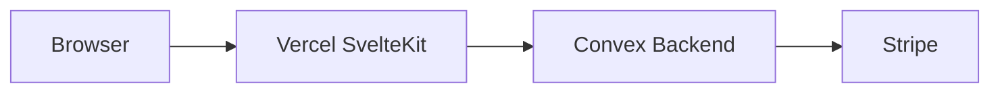

# Vercel Deployment via CLI

## Architecture (from doc)

- **Vercel**: Serves SvelteKit only (SSR/SSG, CDN, env for frontend). No Convex, no Stripe secrets.
- **Convex**: Deployed separately (`npx convex deploy --prod`). All backend secrets and Stripe webhooks live here.
- **Single Vercel env var**: `PUBLIC_CONVEX_URL` (production Convex URL). Set via CLI; never committed.




---

## Prerequisites (you complete before execution)

Per [VERCEL-DEPLOYMENT.md](docs/implementation/VERCEL-DEPLOYMENT.md) §2, you must have:

- Vercel account + GitHub connected; repo `celstate` visible.
- Namecheap: either Vercel nameservers (Option A) or A + CNAME records (Option B) for `celstate.com` / `www`.
- Stripe production: live Price IDs and (for Convex) live secret key + webhook to Convex.
- Convex production: `npx convex deploy --prod` already run; production URL known.
- Convex dashboard: prod env vars set (`GEMINI_API_KEY`, `STRIPE_PRICE_*`, `HOSTING_URL`, `CONVEX_SITE_URL`).

When starting implementation, paste this block (with real values) for env steps:

```
PRODUCTION_DOMAIN=celstate.com
PUBLIC_CONVEX_URL=https://<prod-project>.convex.cloud
```

---

## Implementation steps (CLI-first)

### 1. Install Vercel adapter and fix config

- **Add adapter**: `pnpm add -D @sveltejs/adapter-vercel`
- **Remove adapter-auto**: `pnpm remove @sveltejs/adapter-auto`
- **Update** [svelte.config.js](svelte.config.js): replace `adapter-auto` with `@sveltejs/adapter-vercel`, use `adapter: adapter()` with no options (doc: do not hardcode runtime; Vercel 2026 default is Node 24; set Node version in Vercel project settings if needed).
- **Verify**: `pnpm build` succeeds.

**2026 practice**: Explicit adapter (not `adapter-auto`) for stability and config access. Do not pass `runtime: 'nodejs18.x'` or `'nodejs20.x'`; do not use `split: true` unless required for size limits.

### 2. Link Vercel project

- Ensure logged in: `vercel login` (if needed).
- From repo root: `vercel link` — select existing Vercel project for `celstate` (or create one), confirm framework = SvelteKit.
- **Verify**: `vercel inspect` shows correct project.

### 3. Set environment variable

- `vercel env add PUBLIC_CONVEX_URL production` — paste production Convex URL when prompted.
- `vercel env add PUBLIC_CONVEX_URL preview` — same value (preview deploys use prod Convex unless you add preview Convex later).
- **Verify**: `vercel env ls` shows `PUBLIC_CONVEX_URL` for Production and Preview.

No secrets (Stripe, Gemini) in Vercel; they stay in Convex.

### 4. Add custom domain

- `vercel domains add celstate.com`
- `vercel domains add www.celstate.com`
- If using Namecheap DNS (Option B): Vercel will show required records; confirm A record IP (e.g. `76.76.21.21`) via `vercel domains inspect celstate.com` or current Vercel docs.
- **Verify**: `vercel domains inspect celstate.com` shows valid DNS and TLS.

### 5. Deploy to production

- `vercel --prod`
- **Verify**:  
  - Site loads at `https://celstate.com`.  
  - Auth (Convex) and Stripe redirects work.  
  - Convex prod has `HOSTING_URL=https://celstate.com` so checkout return URLs are correct.

### 6. Optional: Skew protection

- Vercel project → Settings → Advanced → enable Skew Protection (per doc §4 Step 7).

### 7. Optional: Cursor MCP (for future AI-driven deploys)

- Add Vercel MCP to [.cursor/mcp.json](.cursor/mcp.json) as in doc §3.1 (no code changes required for initial deploy).

---

## Do not do (from doc §8)

- Do not use `adapter-auto` in production.
- Do not set Node 18/20 in adapter; prefer dashboard default (Node 22/24).
- Do not put secrets in `.env` or commit them; use `vercel env add` only.
- Do not set Stripe/Gemini keys in Vercel (Convex only).
- Do not point Stripe webhooks at Vercel (Convex HTTP endpoint only).
- Do not run `npx convex deploy` from Vercel build; Convex is deployed separately.
- Do not add `vercel.json` rewrites/redirects unless necessary (SvelteKit handles routing).
- Do not set `split: true` in adapter unless hitting function size limits.

---

## Post-deployment checklist (doc §5)


| Check                    | How                                          |
| ------------------------ | -------------------------------------------- |
| Site at prod domain      | `curl -I https://celstate.com` → 200         |
| HTTPS / no mixed content | Browser lock icon                            |
| www ↔ apex redirect      | `curl -I https://www.celstate.com` → 301/308 |
| Convex client            | No WebSocket errors in console               |
| Auth                     | Full sign-in/sign-out                        |
| Stripe checkout          | Correct redirect URLs                        |
| Preview deploys          | Open PR → Vercel preview URL                 |
| Build on push            | Trivial push → build succeeds in dashboard   |


---

## Files to touch

- [svelte.config.js](svelte.config.js) — adapter swap and config.
- [package.json](package.json) — add `@sveltejs/adapter-vercel`, remove `@sveltejs/adapter-auto`.
- Optional: [.cursor/mcp.json](.cursor/mcp.json) — Vercel MCP entry.

No changes to Convex, Stripe, or app code beyond ensuring build passes with the new adapter.